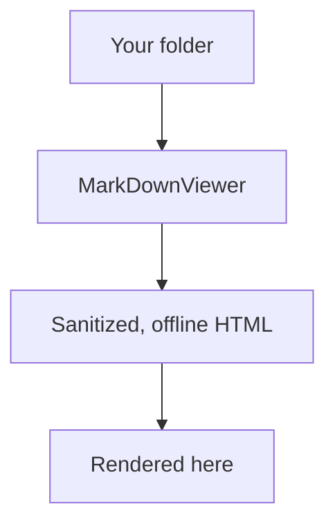

# Welcome to MarkDownViewer

This is the bundled **sample vault** — everything here ships inside the app
itself, so you can see what the renderer does before pointing it at your
own folder. This one document deliberately exercises every renderer
feature: a diagram, inline and block math, a syntax-highlighted code fence,
a relative image, a wiki-link, and a task list.

## Diagram



## Math

Inline: the quadratic formula is $x = \frac{-b \pm \sqrt{b^2 - 4ac}}{2a}$.

Block:

$$
\int_0^1 x^2 \, dx = \frac{1}{3}
$$

## Code

```go
package main

import "fmt"

func main() {
	fmt.Println("hello from the sample vault")
}
```

## Links and images

A relative image, resolved against this document's own folder:


And a wiki-link over to [[Getting Started]] — tapping it is a no-op in this
version; only the vault-wide **Search** tab and the Library tree navigate
between documents so far.

## Reading list

- [x] Skim this document
- [x] Open **Getting Started** from the Library
- [ ] Look inside the `Notes/` folder
- [ ] Point the app at your own folder from the Library's "Choose folder"
      prompt

## About this vault

Everything under this section — this file, `Getting Started.md`,
`Colophon.md`, and the nested `Notes/` folder — is read-only sample
content. Nothing you do here writes back to the app bundle.
